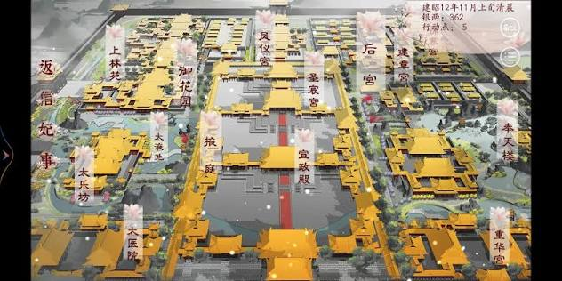

# 紫禁天朝 · 完整皇宫 3D 交互项目实施计划

> **项目范围**：参照用户提供的宫城鸟瞰图，制作包含中轴前朝、后宫、东西宫苑、御花园、城墙、城门与水系的完整皇宫。允许使用外部依赖、第三方模型和贴图。采用主 Agent 统筹、子 Agent 分区协作、统一建筑构件库与视觉标准的工作方式。
>
> **每个 Agent 开工前必须**：阅读本计划、参考图、`docs/STYLE_GUIDE.md`、共享配置、接口和本人任务卡；向主 Agent 回报已读版本、可写范围和依赖，之后才开始实现。共同风格基线尚未建立时，由主 Agent 先建立。
>
> **当前文件是开发计划**。用户只要求修改或整理计划时，不启动代码开发；收到实施要求后再按本计划执行。

## 一、交付范围与独立项目目录

### 1.1 最终要做出来的东西

一个可以俯瞰整座皇宫、选择宫殿查看、沿中轴游览并进入代表性殿堂的 3D Web 项目。第一屏应看到完整宫城的布局、建筑群层次和纵深，进入近景后仍有可观赏的建筑细节。

- **完整宫城**：连续的南北中轴、多进院落、前朝核心建筑、后宫寝殿、东西侧院、御花园、围墙、四角角楼、城门、护城河与桥梁。
- **建筑规模**：初始目标为至少 50 栋可独立识别的有顶建筑，含宫殿、门殿、厢房、亭阁和角楼；廊道按段另外统计。至少形成 12 个有墙、门或廊道界定的院落。数量和分布写入布局清单，不能靠拆分同一建筑或密集堆放重复房屋凑数。
- **层级清楚**：主殿最宏伟；次级殿堂、门楼、侧院建筑和亭阁逐级减小。中轴有开阔广场，左右有较密的院落群，北部有花园，整体疏密接近参考图。
- **重点内景**：主殿金銮殿和一处后宫寝殿提供可进入的完整内景；其他建筑优先保证外观、院落和游览路径完整，不要求所有房间均可进入。不可进入的建筑在交互中明确说明。
- **完整体验**：全城鸟瞰、多角度模式（八种视角，含第一人称漫游）、分区跳转、建筑选中与信息面板、中轴导览、昼夕夜切换、小地图与复位。

上述数量属于项目设计目标，不是对真实紫禁城建筑数量或尺寸的考据声明。

### 1.2 所有内容收纳在一个文件夹

项目根目录固定为原 `AI_Test` 目录内的 `imperial-palace/`。计划、参考图、代码、下载模型、贴图、构建输出与说明全部放在这个目录下；任何命令先确认工作目录，避免把文件散落到 `AI_Test` 或其他项目中。

```text
imperial-palace/
├── imperial-palace-plan.md       # 当前总计划
├── README.md                    # 当前状态；开发时补充安装、运行、构建、操作说明
├── index.html                   # 开发入口；实施时创建
├── package.json                 # 主 Agent 管理依赖
├── <包管理器锁文件>              # 只使用一种包管理器
├── docs/
│   ├── STYLE_GUIDE.md            # 风格基线、版本、参考截图索引
│   ├── CONTRACTS.md              # 接口、资源所有权与事件约定
│   ├── ASSET_CREDITS.md          # 第三方模型、贴图、字体与许可
│   └── handoffs/<task-id>.md     # 各任务开工与交付回执
├── assets/reference/
│   └── palace-layout.png        # 用户提供的布局参考图
├── public/assets/
│   ├── models/                  # 处理后的运行时模型
│   ├── textures/                # 统一后的贴图
│   ├── environments/            # HDR/环境资源
│   └── fonts/                   # 如确有需要，存放许可允许的字体
├── work/                        # 下载原件、转换中间件和临时分析，不进入发布包
├── src/
│   ├── main.js                  # 主 Agent：组装与唯一动画循环
│   ├── core/                    # 主 Agent：渲染、加载、全局状态、环境系统
│   ├── shared/                  # 主 Agent：配置、布局、接口与事件
│   ├── kit/                     # A：统一建筑构件、材质、模型注册与 LOD
│   ├── zones/
│   │   ├── forecourt.js         # B：中轴前朝
│   │   ├── inner-palace.js      # C：后宫
│   │   ├── west-courts.js       # D：西侧宫苑
│   │   ├── east-courts.js       # E：东侧宫苑
│   │   └── garden-boundary.js   # F：御花园、城墙、外城门与水系
│   ├── interaction/             # G：控制、选中、导览、移动与碰撞
│   └── ui/                      # G：HUD、标签、信息面板、小地图
├── scripts/                     # 主 Agent：构建或资源处理工具
├── tests/                       # 必要的接口、布局或交互检查
└── dist/                        # 构建产物，保持资源相对路径
```

现在仅整理计划、参考图和 README；其余目录在实施时按需创建。最终按完整项目文件夹交付，可附压缩包。**取消原来的强制单 HTML 和零外部资源限制**，正常多文件工程即可。开发与预览通过 HTTP 服务运行，README 提供经过实际验证的命令。

## 二、参考图与宫城总体布局

### 2.1 如何使用参考图



参考图用于确定空间关系和整体观感：高位斜俯视、中央礼仪轴线、多重宫门与庭院、金黄屋顶、灰白铺地、左右院落群、后部宫苑，以及点缀的树木与水景。

提取建筑群的布局和视觉层级；图中的游戏状态、资源数值、竖向菜单与可见文字不构成本项目功能或命名要求。宫殿名可采用清楚易懂的功能名称，无需逐字照搬。整体是参考图启发的明清皇家宫城，不默认承诺历史原址的精确复原。

### 2.2 布局示意

```text
                         北 / +Z
       护城河 ┌────────北城门────────┐ 护城河
              │ 角楼   御花园与亭阁   角楼 │
              │ 西后院  后宫寝殿群  东后院 │
              │ 西宫苑  内廷门庭院  东宫苑 │
              │ 西侧院  后殿/中殿   东侧院 │
              │ 西配殿  主殿与台基  东配殿 │
              │ 西侧院  礼仪大广场  东侧院 │
              │    廊庑  前朝门殿  廊庑    │
              │ 角楼    南城门      角楼   │
       护城河 └────────桥梁─────────┘ 护城河
                         南 / -Z
```

主 Agent 先制作全城灰盒和鸟瞰截图，确认宫墙完整、中轴贯通、院落有层级、四周有边界，再安排细化。应从最初可运行版本就看得出是一整座皇宫。

### 2.3 坐标、区域边界与连接规则

- 单位统一为米，Y 向上，X 向东，Z 向北；宫城地面中心为 `(0,0,0)`，建筑正面通常朝南 `-Z`。
- 初始设计包络：宫墙内约 `600m × 900m`，即 `X ∈ [-300,300]`、`Z ∈ [-450,450]`；护城河、桥梁和外侧地形在包络外留出空间。此尺寸是设计起点，不是史实参数。
- 中央区建议 `X ∈ [-100,100]`；前朝约 `Z ∈ [-400,80]`，后宫约 `Z ∈ [80,300]`，花园约 `Z ∈ [300,420]`；东西侧院分别分配在中央区两侧。
- 主 Agent 将最终 polygon/bounds、入口、出口、路面标高、围墙归属和建筑 footprint 写入 `src/shared/layout.js` 并冻结；坐标调整通过版本变更通知，不能由各区域自行扩张。
- 每条跨区通道只有一个连接 ID，两端共享位置、宽度和标高；一个边界墙段、桥或门仅由一个区域负责。F 拥有外宫墙、四角角楼、四面外城门、护城河、入城桥与基底地形；B 从南城门内侧开始负责前朝，C 负责内廷门及其以北后宫。
- 主殿台基可沿用三层、总高约 `4.5m` 的设计，主殿面阔按全城灰盒比例确定。其他院落、殿堂、桥和花园分别使用其登记标高，不能把全城地坪统一抬到 `4.5m`。
- 路径从南桥、南城门、礼仪广场、主殿台基、内廷门连至后宫与花园；东西侧院有支路相通。没有内景的建筑为障碍物，不可误作可穿越空间。

## 三、共同风格基线：每个 Agent 开工前必读

### 3.1 风格定位与共同参数

**精致、略带风格化的皇家宫城沙盘**：采用明清官式建筑语言，突出金顶、朱墙、白石和整齐院落。远景轮廓清晰、疏密有序，近景细节精致，材质光泽克制。同一套模型语言贯穿整城。

| 项目 | 统一规范 |
| --- | --- |
| 主色 | 琉璃金 `#dfa112`、宫红 `#962822`、暖白石 `#f0ece1`、青绿彩画 `#1c4e40`、深灰铺地 `#575652`、室内金砖 `#1a1917`、鎏金 `#ffc83b` |
| 建筑轮廓 | 同类建筑采用一致的屋顶坡度、飞檐弧度、柱径、檐高与开间模数；主次建筑通过参数与装饰等级区分 |
| 材质 | 琉璃瓦为有清漆感的非纯金属；鎏金才有明显金属反射；白石温润；木作轻微纹理；旧化统一且较轻 |
| 模型细节 | 主殿、宫门、角楼是重点；侧院和远景减少细节但保留同样的形制；禁止把未经适配的低模、写实和不同题材素材直接混搭 |
| 植物与水 | 树冠形状、饱和度、尺度与摆放密度一致；花树作点缀；水面低饱和、反射适度，不抢建筑主体 |
| 光照 | 全城共享太阳、环境光、曝光、色调映射和阴影策略；区域仅声明灯位，由统一环境系统生成灯光 |
| UI | 中文衬线标题、朱红印章、暗金细线、深色半透明面板；间距阶梯 `4/8/12/16/24/32px`，面板圆角 `4px`；视角切换器、时辰与质量为同一套控件规范 |
| 动效 | 默认镜头过渡 `1.2s`、UI 过渡 `180ms`；烟、树、水均缓慢自然；全场一个动画循环 |
| 随机性 | 使用统一场景种子，每个区域派生固定随机序列，便于复现和截图比对 |

以上是初始设计值，主 Agent 校准后写入 `src/shared/config.js`，作为代码数值唯一来源。`docs/STYLE_GUIDE.md` 记录基线版本、比例、材质对应、参考图和验收视角。说明与配置发生冲突时先由主 Agent 同步修正，子 Agent 不自行选择一套。

### 3.2 必须先做共同风格样板

主 Agent 与 A 先完成一个标准院落样板：一座殿堂、一段宫墙、一扇门、一段回廊、白石台阶、铺地、树木和灯具，并展示标准 HUD。

在 `1440×900`、DPR `1`、默认金辉、固定相机下保存样板截图；确定素材的共同尺度、材质、色调和细节等级后，主 Agent 发布基线版本，再让区域 Agent 批量搭建。任何新增模型都先放进样板场景对比。

**风格验收**：同时看全城鸟瞰和区域近景，逐项检查屋顶是否同色同光泽、殿堂比例是否协调、铺地尺度是否一致、院墙连接是否连续、树木是否同一风格、UI 是否同一套字体与间距。昼景通过后再检查夕照和夜景。

### 3.3 子 Agent 开工与变更协议

每个 Agent 在首次开工、换任务或恢复任务时，阅读本计划、参考图、风格指南、`CONTRACTS.md`、共享配置与布局，以及本人任务卡；然后向主 Agent 发回：

```text
任务 ID / Agent：
已读计划、风格与接口版本：
可写文件 / 只读依赖：
区域边界 / 连接 ID / 使用的建筑 kit 与材质：
要消费和返回的接口：
验收方式 / 性能预算：
依赖齐备情况 / 发现的冲突：
```

- 任务卡已经冻结的常规设计直接执行，不重复向用户确认；有影响共同风格、区域连接或共享接口的冲突时先向主 Agent 报告。
- 只写本人负责文件；跨区修改由主 Agent 分派给文件负责人。各 Agent 不同时改 `main.js`、布局、主题、依赖清单或锁文件。
- 共享参数与接口变更由主 Agent 递增版本并通知受影响任务。旧版产物适配后才能合入。
- 上游未完成时可以使用明确标注的占位接口开发独立部分；交付前必须替换真实依赖，占位品不能标记为完成。
- 完成回执包含文件列表、接口、基线版本、截图、实际检查步骤和结果、性能数据及已知问题；未测内容明确标记“未验证”。

## 四、允许外部模型、依赖与贴图的资源流程

### 4.1 技术与资源选择

- 采用 Three.js 与模块化 JavaScript；允许使用构建工具、模型加载器、相机控制、后处理、模型压缩解码器、导航或碰撞辅助库。主 Agent 根据实际需要选择，统一固定依赖版本并提交锁文件。
- 允许第三方宫殿、屋顶、斗栱、雕刻、树木、假山、家具、灯具等模型，允许 PBR 贴图、HDR 环境图和字体。优先复用同一套建筑资源，缺少的构件用程序化建模补齐。
- 模型运行时优先整理为 GLB/glTF；其他格式可在 `work/` 转换。需要的解码器随项目正确配置与交付。
- 程序化材质是可选手段，可用于云纹、彩画、石材、铺地与补充细节；取消“所有纹理必须 Canvas 绘制”的要求。
- 依赖与运行资源优先随构建本地提供，外部来源不等于运行时热链。若有必需的在线资源，加载失败应有可见提示，README 说明网络前提。

### 4.2 模型接入与统一加工

由 A 统一管理资源接入，区域 Agent 向 A 提交所需构件清单。新模型按以下步骤进入构件库：

1. 记录来源链接、作者、许可、下载版本或日期及用途；仅采用许可允许本项目使用和交付的资源，需要署名的写入 `docs/ASSET_CREDITS.md`。
2. 统一单位、朝向、地面 pivot、缩放、法线、材质和贴图色彩空间；记录模型包围盒和放置锚点。
3. 把瓦、木、石、漆、金属等映射到全场材质规范；处理不匹配的烘焙高光、过重污损和过饱和贴图。无法协调的模型换用同风格资源或重建。
4. 按近中远景制作 LOD 或低细节替代；重复构件实例化，去掉不可见内部面与不必要的高分辨率贴图。
5. 在共同样板中确认尺寸、色调和细节，再登记到 kit，提供稳定构件名称、参数、LOD、资源成本和接口。

资产登记至少包含 `id、sourceUrl、author、license、localPath、normalization、bounds、lod、usedBy`。同一份模型和贴图只保留一份运行时资源，各区域共享使用；避免重复下载和重复 GPU 上传。

## 五、建筑群与各区域具体要求

### 5.1 统一建筑构件库 A

提供 `hall`、`gateHall`、`sideHall`、`pavilion`、`cornerTower`、`wall`、`courtyardGate`、`corridor`、`terrace`、`stairs`、`bridge` 等构件工厂，以及树木、山石、灯具、石栏和铜器等共享摆件。

参数至少包括开间数、尺寸、台基高度、朝向、屋顶类型、装饰等级和质量档位。主殿使用重檐庑殿顶，次级建筑可用协调的歇山、硬山或亭顶；同类构件形制一致。庑殿顶应有长正脊和四面坡，不能用简单尖顶替代。

重点保留朱红柱、青绿彩画、飞檐、斗栱、金瓦、脊兽、白石台基与栏杆的识别特征。近景显示细节，远景保留屋顶和建筑轮廓。

### 5.2 中轴前朝 B

- 南城门内侧到前朝门殿、礼仪广场、主殿、次级中殿与后殿组成清晰递进的中轴。
- 主殿位于三层白石台基上，中央丹陛御道、两侧台阶、雕花栏杆与平台陈设完整；与前后广场路径相通。
- 前朝两侧有配殿和廊庑，形成围合，不把广场四周留成无边界空地。
- 主殿内部含金砖地面、金銮宝座、屏风、盘龙柱和藻井；保留门洞和通道，提供观赏机位。

### 5.3 后宫 C

- 至少三进主要内廷院落，包含内廷门、核心寝殿、东西配房和较小庭院。
- 相较前朝，尺度收敛、围合更强，保留中轴但增加生活空间感。
- 一处寝殿提供可进入内景，陈设、门窗与材质来自共同构件库。
- 向北接御花园，东西设通往侧院的门道，与 B/F 的接口坐标一致。

### 5.4 西侧宫苑 D 与东侧宫苑 E

- 每侧至少四组可识别院落，各有门、主屋、配房及连接步道；两侧均有足够体量，不能只给中轴添几栋孤立小屋。
- 西侧可设置礼乐、书院、服务院落等主题；东侧可设置文华、陈设、生活宫苑等主题。名称是展示设定，不作为史实断言。
- 两侧在色调、模数和屋顶等级上统一，通过院落规模、植物、水池、亭廊与摆件区分用途，避免全部机械镜像。
- 自有院落的内墙和道路由各区域负责，外宫墙、城门和外水系归 F；边界通道按连接 ID 对齐。

### 5.5 御花园、边界与水系 F

- 花园包含中央亭阁、曲折步道、树群、假山、小型水景和廊道，与后宫相连。
- 宫城四周的红墙完整闭合，四角角楼清楚可见，南北主门和东西侧门具有层级。
- 护城河与桥梁构成完整外边界；水体、陆地、墙基和道路不穿插。入口桥连接南城门和外侧落脚点。
- 地形和外边界适合全城鸟瞰，避免出现建筑悬空、底板截断或河道无故终止。

## 六、模块接口、交互与统一环境

### 6.1 模块契约

主 Agent 在派发区域任务前将以下契约补全到 `docs/CONTRACTS.md` 和 `src/shared/`：

```javascript
// 每个区域同一入口；异步加载由共享 loader 管理。
export async function createZone(ctx) {
  // ctx: THREE, config, zoneLayout, kit, assets, rng, events
  return {
    root,        // 未挂到 scene 的 Group；按登记世界坐标放置
    buildings,   // { id, name, category, bounds, entrance, visitable, info }
    connectors,  // { id, position, width, elevation }；与全局布局对应
    colliders,   // 统一世界坐标的障碍与可行走面
    viewpoints,  // { id, position, target, mode }
    lightAnchors,// 灯具位置和类型；由全局环境系统配置灯光
    update,      // (dtSeconds, elapsedSeconds, state) => void
    dispose      // 只释放模块自有资源
  };
}
```

- 主 Agent 独占 scene 挂载、renderer/composer、全局光照、相机裁剪策略、resize、状态与动画循环；每个区域根节点保持单位变换，模型内部归一化由 kit 完成。
- 建筑 ID 使用区域前缀，稳定且全局唯一；小地图、选中、信息面板与导览都消费同一份建筑注册表。
- 障碍采用约定的世界坐标包围盒或碰撞网格；可行走面提供区域范围和地面高度。主 Agent 定义碰撞数据格式、重叠面的选择、玩家体积、台阶阈值和跳跃规则，G 实现。
- 资产缓存和共享材质由 A 的资源管理器持有；单个区域卸载时只释放自有资源，不销毁其他区域仍在使用的模型或贴图。
- `state` 至少包含 `mode`、`viewMode`、`selectedBuildingId`、`timePreset`、`quality`、`tourState`。UI 与键盘发送相同的请求事件，由统一控制器处理；不能各自维护一套状态。
- `viewpoints` 至少包含区域机位与第一人称出生点，字段与 6.4 的视角登记一致；主 Agent 汇总成全局视角表，G 只读消费。
- 相机装置由主 Agent 在 `core/` 提供唯一实现，八种视角都在同一装置内切换，不新增第二套相机控制。

### 6.2 游览与 UI G

- **全城鸟瞰**：首屏从南向北高位斜俯视，完整呈现宫墙与宫殿群。支持旋转、平移和缩放，镜头范围根据全城 bounds 设置。
- **多角度模式**：统一视角切换器，八种模式见 6.4；键盘 `1–8`、按钮和第一人称 `F` 发送同一条请求事件。
- **分区跳转**：按钮对应全城、前朝、主殿、后宫、西宫苑、东宫苑、御花园；统一平滑过渡。
- **建筑信息**：悬停或点选建筑高亮，显示名称、用途与是否可入内；标签按缩放层级显隐，避免全城密集重叠。
- **中轴导览**：从南桥到花园，设置若干讲解点，支持暂停、继续和退出；用户手动控制相机时退出或暂停导览，不争夺相机。
- **第一人称**：属于多角度模式之一，按 6.4 的深度行走要求实现；点击按钮或 `F` 切换，Esc 释放指针锁后可恢复，提供回到全城按钮。
- **小地图**：基于统一布局显示宫墙、区域与当前位置，可选择区域定位。
- **UI 状态**：加载进度、资源失败与重试、操作提示、时辰按钮和质量选项完整。窄屏保持可读可操作；触屏至少保证鸟瞰和点选可用，并明确漫游操作的支持范围。

### 6.3 光照与氛围由主 Agent 统一管理

全城共用盛世金辉、落霞夕照、寒月宫灯三个预设；统一太阳方向、天空、曝光和环境反射。区域贡献灯位，夜景按距离和重要性激活有限灯光，远处使用发光材质代替大量实时点光。

香炉轻烟、花园微风、水面微波和少量微尘统一更新。Bloom 克制，保证金瓦保留细节。落雪属于可选增强，在完整宫城和核心交互通过后再做。

### 6.4 多角度模式（含第一人称）

全城共用一个相机装置，"多角度模式"是同一装置上的视角清单，不是多套独立相机逻辑。切换统一走 `state.viewMode` 加固定时长过渡；键盘 `1–8` 与 UI 视角切换器发送同一请求事件。

| 编号 | 模式 | 用途 | 默认机位与约束 |
| --- | --- | --- | --- |
| 1 | 全城鸟瞰 `oblique` | 首屏、总览 | 南侧高位斜俯视，覆盖全部宫墙、城门与护城河，限制极角与目标半径 |
| 2 | 等距沙盘 `iso` | 沙盘式观察、截图比对 | 45° 方位、35.26° 仰角，正交投影，允许缓慢环绕，机位固定在包络中心 |
| 3 | 中轴透视 `axis` | 礼仪序列、导览 | 从南桥上空沿中轴向北，透视相机，可分段推进 |
| 4 | 分区视角 `zone` | 七分区跳转 | 每分区一个登记机位，前朝、后宫、西宫苑、东宫苑、御花园、城门与花园各有取景 |
| 5 | 建筑近景 `focus` | 选中建筑 | 由建筑 bounds 与朝向计算正前 3/4 取景，距离随体量自适应 |
| 6 | 室内视角 `interior` | 金銮殿与寝殿 | 使用区域登记的室内机位，限制在室内包围盒内，不穿墙不出顶 |
| 7 | 第一人称 `fp` | 漫游与验收走查 | 行走视角，见下 |
| 8 | 自由环绕 `orbit` | 观察与取景 | 环绕全城或当前焦点，限制极角、距离与目标半径，可复位 |

**第一人称（模式 7）要求**：

- 由按钮或 `F` 进入；进入时停在最近的有效可行走点，朝向中轴或当前选中建筑；退出后恢复进入前的模式与机位参数。
- 视线高度按所在可行走面取 `面高 + 1.65m`，可行走面包括地面、台基、台阶顶、桥面与室内地面；上下台阶有平滑过渡。
- 台阶、桥面、门洞、丹陛可正常通过；墙、柱、栏杆、建筑体块、假山与水面不可穿越，不能掉出宫城包络。
- 操作：`WASD` 或方向键移动、`Shift` 加速、鼠标拖动或指针锁定转视角；`Esc` 释放指针锁后可继续拖动视角或按 `F` 返回。
- 完整走查路线必须可通：南桥 → 南城门 → 前朝广场 → 主殿台基 → 金銮殿内景 → 内廷门 → 寝殿内景 → 御花园；东西宫苑可经侧门到达。
- 不可进入的建筑给出可见提示，不允许出现穿模、卡死或悬空；相机 near 值不能代替碰撞检测。
- 第一人称与导览互斥：进入第一人称时暂停导览；用户在导览中接管相机时，导览暂停并给出提示。

**接口**：区域通过 `viewpoints` 登记 `{ id, name, mode: 'zone' | 'interior' | 'fp-spawn' | 'focus-extra', position, target, fov?, area? }`；主 Agent 汇总为全局视角表并冻结，G 只读消费、不自行新增机位。每个区域至少提供 1 个 `zone` 机位与 1 个 `fp-spawn`；B 与 C 额外各提供 1 个 `interior` 机位。

**验收**：八种模式各自有固定机位参数与截图；`1–8`、按钮、`F`、`Esc` 的行为一致；第一人称按上述路线实际走查，记录通过的门洞、台阶与不可通行判定。

## 七、子 Agent 分工、文件归属与并行顺序

### 7.1 任务分配

| 角色 | 可写范围 | 输入依赖 | 交付要求 |
| --- | --- | --- | --- |
| 主 Agent | 入口、`core/`、`shared/`、构建、依赖、README、风格与接口说明 | 本计划和参考图 | 灰盒、样板、契约、文件归属、全局环境、唯一相机装置与多角度模式内核、集成和最终验收 |
| A 资源与建筑库 | `src/kit/`、`public/assets/`、资源登记、本人资源处理中间件 | 主 Agent 冻结的尺寸/风格规则 | 外部资源统一加工，标准构件工厂、材质、资产缓存与 LOD 可复用 |
| B 前朝 | `src/zones/forecourt.js` | 冻结的前朝边界与 A 的 kit | 完整中轴前朝、主殿台基和金銮殿内景 |
| C 后宫 | `src/zones/inner-palace.js` | 冻结的后宫边界与 A 的 kit | 多进内廷、寝殿内景、前后与东西通路 |
| D 西宫苑 | `src/zones/west-courts.js` | 冻结的西区边界与 A 的 kit | 至少四组侧院、连接道路与完整装饰 |
| E 东宫苑 | `src/zones/east-courts.js` | 冻结的东区边界与 A 的 kit | 至少四组侧院、连接道路与完整装饰 |
| F 花园与边界 | `src/zones/garden-boundary.js` | 完整宫城边界、后宫出口与 A 的 kit | 御花园、全城地形、围墙、角楼、外城门、桥和水系 |
| G 交互与 UI | `src/interaction/`、`src/ui/` | 事件、建筑/碰撞注册表、全局视角表与 UI token | 多角度模式切换器（含第一人称交互）、导览、选中、小地图、HUD 和加载状态 |

各任务另可维护自己的 `docs/handoffs/<task-id>.md`。区域 Agent 需要新资产时提交需求给 A，不各自建立私有素材库。需要修改依赖、布局或全局风格时交给主 Agent。所有共享修改必须明确唯一负责人。

### 7.2 批次安排

1. **主 Agent 准备**：建立目录、技术骨架、全城灰盒、区域边界、入口与连接表、共享接口和建筑数量分配。
2. **共同样板**：A 建立资源与建筑 kit；主 Agent 同时完成渲染、统一状态、光照和样板预览。主 Agent 校准并发布风格/接口 v1 后才进入区域细化。
3. **第一批 B/C/F**：并行完成中轴前朝、后宫、花园与宫城边界，形成从南到北的全城骨架；三者登记分区机位、第一人称出生点和 B/C 的室内机位。主 Agent 持续集成并检查边界连接。
4. **第二批 D/E/G**：并行补齐东西宫苑与交互 UI。G 先按冻结的相机装置接口实现多角度模式（八视角含第一人称）与导览，最终接入全部真实区域，按 6.4 的路线走查整城。
5. **整城收口**：主 Agent 统一检查完整度、风格、连接、资产与性能，将具体问题派回对应负责人；源代码修正后重建发布包。

A–G 是任务角色，不要求同时启动七个 Agent。四个并发名额时采用“主 Agent + 最多三个子 Agent”，少于四个则按依赖顺序排队；需要 A 修补构件时安排空闲名额或暂停受影响任务，避免未经统筹的多人改库。

### 7.3 派发模板与完成条件

```text
任务 ID / 目标：
必读：本计划、参考图、STYLE_GUIDE.md、CONTRACTS.md、config、layout
基线版本 / 样板截图路径：
可写文件 / 只读依赖：
区域边界 / 连接 ID / 入口与标高：
可用 kit 和资产 / 缺失构件：
必须提供的建筑注册、碰撞、灯位，以及 zone / interior / fp-spawn 机位：
建筑数量、性能预算和验收步骤：
开工回执 / 交付回执路径：
```

一个任务只有在真实资产和接口接入、范围内建筑完整、风格一致、连接可用、预算有实测、主 Agent 完成集成检查后才能标记完成。完成回执必须说明尚未验证或存在限制的项目。

## 八、完整度、性能与交付验收

### 8.1 分阶段验收

- **G0 布局通过**：灰盒已展示整城、东西侧院、后宫、花园、城墙和水系；区域边界、建筑数量和连接 ID 全部登记。
- **G1 基线通过**：标准院落样板、统一资源库、风格指南、接口和文件归属已发布；外部资产有记录且已适配。
- **G2 场景完整**：所有区域替换占位物，至少 50 栋可识别建筑、12 个院落，四角和城墙完整，主殿与寝殿内景可进入。
- **G3 体验通过**：多角度模式八种视角（含第一人称）逐一切换正常，分区按钮、建筑选中、导览、小地图、昼夕夜、加载失败状态可以在整城工作；进入与退出第一人称能恢复原机位。
- **G4 风格与性能通过**：固定视角比对无明显素材拼接感，真实设备测试记录齐全，必要的 LOD 和质量降级有效。
- **G5 发布通过**：从项目根目录能按 README 安装、启动和构建；`dist/` 通过 HTTP 预览，资源路径正确，第三方许可与归属说明齐全。

### 8.2 面向完整宫城的预算

取消单殿方案中“一律 120 Draw Call、任何设备必达 60 FPS”的硬性承诺。为整城设立初始预算，主 Agent 根据实测调整并记录理由：

| 项目 | 初始目标 |
| --- | --- |
| 中等质量参考视口 | `1440×900`、DPR `1`，记录测试 GPU、浏览器与质量设置 |
| 帧率 | 目标 60 FPS；较弱设备通过低质量档争取稳定 30 FPS，按实测报告 |
| 主场景渲染调用 | 单次主场景常规渲染 ≤ 350；初始分配 B 70、C 50、D 40、E 40、F 80，保留 70 给集成与调整 |
| 可见几何 | 鸟瞰与漫游默认目标 ≤ 150 万三角面；通过区域可见性、实例化与 LOD 控制 |
| 纹理 | 常规模型 1K–2K，4K 仅在重点近景确有收益时使用；按共享图集与压缩格式减少占用 |
| 加载 | 优先加载全城低细节外观，再按区域加载重点和内景；首个可交互场景所需资源传输目标 ≤ 25MB |
| 动态阴影 | 优先一盏主要方向光；重点附近启用高质量阴影，避免所有宫灯投影 |

Draw Call 要分别记录主场景单次值和含阴影、后处理的整帧成本。每个任务回报自身开销，主 Agent 以整城实测为最终依据；初始预算不等于达标证明。

全景及完整导览路径各预热后采样至少 30 秒，记录平均 FPS、P95 帧耗时、绘制调用、可见三角数及资源体积。调低 DPR、阴影、LOD、实时灯或粒子后重新检查视觉；不得通过删除某个宫苑来达成性能指标。

### 8.3 最终检查清单

- [ ] 所有项目文件都在独立 `imperial-palace/` 内，其他 `AI_Test` 项目未被修改。
- [ ] 首屏一眼可见完整皇宫，参考图的中轴、多进院落、左右侧院和后部宫苑结构得到体现。
- [ ] 建筑和院落数量可由注册表核对，没有用廊段、重复编号或拆件虚增建筑数。
- [ ] 宫墙、角楼、城门、桥与水系完整，中轴和侧院道路相通，跨区无断路、重墙或悬空。
- [ ] 主殿与代表寝殿的内景完整可进入，其他建筑进入权限与提示一致。
- [ ] 所有 Agent 有开工与交付回执，使用同一风格与接口版本。
- [ ] 外部模型的尺度、朝向、材质、细节和 LOD 已适配，第三方来源与许可可查。
- [ ] 固定全城、前朝、后宫、东西宫苑、花园和两个内景视角通过风格检查；三个时辰都无明显过曝或不可读暗区。
- [ ] 多角度模式八种视角（含第一人称）逐一验收：`1–8`、按钮、`F`、`Esc` 行为一致，进入与退出第一人称能恢复原机位。
- [ ] 相机切换、导览、选中、漫游、分区跳转与回到全城正常；键盘与按钮状态一致。
- [ ] 第一人称按 6.4 路线（南桥 → 南城门 → 前朝广场 → 主殿台基 → 金銮殿内景 → 内廷门 → 寝殿内景 → 御花园）实际走查通过；墙柱阻挡、台阶高度、桥面、丹陛和主要门洞均验证；相机 near 值不能代替碰撞检测。
- [ ] 没有每个区域独立启动的渲染循环，共享资源不会被局部卸载误释放。
- [ ] 生成产物无资源 404、关键运行错误或遗留占位物，实际性能与加载数据已记录。
- [ ] README 给出的安装、开发与构建命令实测可用，项目交付包括必要资源和许可说明。

> **实施启动指令**：先建立完整宫城灰盒、共同建筑样板、统一资源库与唯一相机装置（含 6.4 多角度模式和第一人称内核），再按任务卡分配子 Agent。每个 Agent 开工前读同一份规范并回报，主 Agent 负责把各区域整合成风格统一、道路连通、可完整游览的一整座皇宫，并按 6.4 完成八视角与第一人称走查。最终交付一个独立且可运行的项目文件夹。
